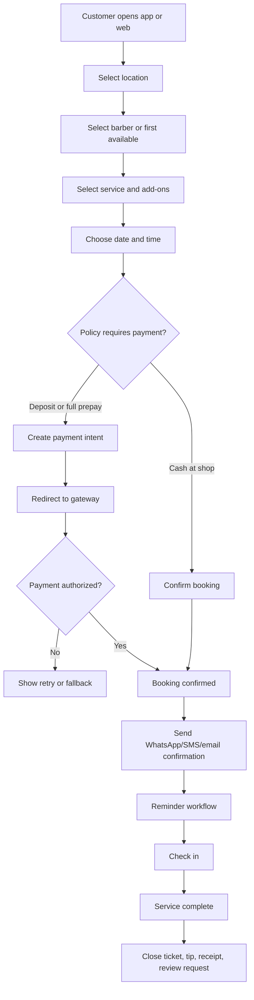
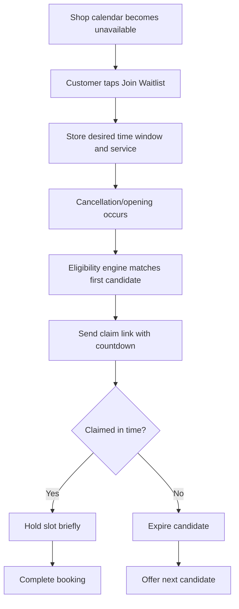
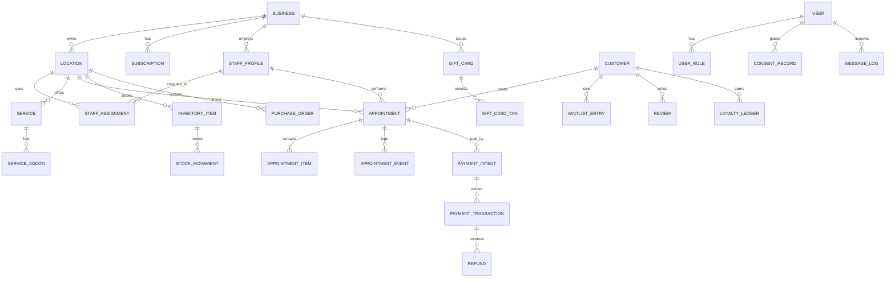

# حلاقي My Barber Product Requirements Document

## Executive summary

**حلاقي My Barber** should be built as an Oman-only, production-ready barber/shop operating system that matches the functional breadth of Squire’s public product surface, then exceeds it on localization, Oman-first payments, compliance readiness, accessibility, and operational simplicity for independent barbers, chair-rental shops, and multi-barber locations. Squire’s official site and Commander app position the benchmark well beyond booking: guest booking without account creation, booking from web/app/Google/Instagram, add-ons, group appointments, recurring appointments, reminders, no-show protection, waitlist automation, client profiles, individual booking links, POS and tap-to-pay, front-desk workflows, staff permissions, commissions and rent collection, inventory and purchase orders, loyalty, gift cards, branded apps/sites, reporting, AI-driven rebooking, and an AI receptionist. citeturn27view0turn28view0turn29view0turn29view1turn29view2turn31view0turn30view0turn6view3turn5search1turn3view1turn6view5turn7search15turn4search2turn4search1turn12view0

The public App Store listing reinforces that Squire Commander is an actively maintained operational app rather than a thin companion experience. The listing describes “control everything from one location,” sell products and services, send marketing texts and emails, manage payroll, schedule appointments quickly, offer barber bios, take payments through Apple Pay/chip reader/swipe, and support online booking, inventory, gift cards, loyalty, Instagram integration, and waitlist. It also shows a 4.7 rating from 397 ratings, English-only language support, Wallet support, and a release history with frequent bug-fix updates through March–May 2026. Apple’s App Store page also says the developer has **not yet indicated which accessibility features** the app supports. citeturn9view1turn9view2turn26view0turn26view2

For Oman, localization is not a cosmetic add-on. The National Centre for Statistics and Information showed Oman’s population at 56.8% Omani and 43.2% expatriate at the end of May 2026, which materially strengthens the case for a multilingual frontline product. Squire Commander’s public App Store listing is English-only, so **حلاقي My Barber** should launch with **English, Arabic, Hindi, and Urdu**; and because Arabic and Urdu use right-to-left scripts, both must receive true RTL layout support, while Hindi remains LTR. citeturn32search0turn26view0turn13search0turn13search1turn13search6

Payments and compliance must also be localized from day one. Thawani publicly offers a UAT environment, API keys, developer docs, a webhook URL concept, transaction reporting, future-payment detail saving, and refunds within 24 hours; PayTabs publicly offers mobile SDKs, backend packages, a hosted payment page flow suited to PCI SAQ A merchants, tokenization, and token-based recurring payments; OmanNet onboarding is publicly exposed through a Central Bank of Oman service route, but appears more enterprise- and integration-document-driven than Thawani or PayTabs. On the legal side, Oman’s Personal Data Protection Law and Executive Regulations, Electronic Transactions Law, VAT framework, and Fawtara e-invoicing rollout all impose requirements that should shape the product architecture from the start. citeturn15view2turn15view3turn20search0turn15view4turn42view0turn42view1turn15view0turn15view1turn37search0turn37search2turn36search6turn43view0turn43view1turn43view2

The core product decision is therefore straightforward: **match Squire where the workflow is proven, improve where Oman requires it**. That means parity on booking, scheduling, retention, payments, staff economics, reporting, and branded experience, while improving on multilingual UX, WhatsApp-first messaging, Oman gateway orchestration, PDPL workflows, VAT/e-invoicing readiness, RTL quality, accessibility, and a cleaner merchant onboarding path for Muscat-first rollout.

## Benchmark findings from Squire

Squire’s public materials reveal a clear product architecture: a customer acquisition and booking layer, a barber operating layer, a shop-management layer, and a growth/retention layer. Official pages specifically confirm quick guest booking, Apple Pay/Google Pay/card payment, add-ons, gift cards, group appointments, booking from branded app, website, Instagram, and Google; scheduling with block time, rescheduling, recurring appointments, and recurring/shop calendar control; reminders and no-show/cancellation policy enforcement; same-day waitlist; client profiles and quick contact; Instagram booking; POS with or without hardware; staff permissions and performance; front desk kiosk; commissions and rent collection; inventory and purchase orders; loyalty; gift cards; reports and leaderboards; branded apps; AI rebooking (Engage); and AI phone booking (Operator). citeturn27view0turn28view0turn3view3turn29view1turn29view2turn3view0turn29view3turn31view0turn30view0turn6view2turn6view4turn2view6turn5search1turn3view1turn6view5turn6view3turn7search15turn4search2turn4search1turn12view0

The most important product lesson is that Squire is not organized as isolated features. It is organized around **operational continuity**: every customer touchpoint feeds schedule integrity, every appointment feeds payment capture, every payment feeds staff economics, and every transaction feeds reporting and retention. That systems-level coherence is what **حلاقي My Barber** should copy. The improvement area is equally clear: the benchmark is not yet localized for Oman, its App Store listing is English-only, and the accessibility disclosure is weak. citeturn31view1turn31view0turn6view3turn26view0turn26view2

### Benchmark matrix

The table below synthesizes the benchmark from Squire’s official pricing pages, feature pages, and Commander App Store listing. citeturn12view0turn27view0turn28view0turn29view1turn29view2turn31view0turn30view0turn26view0

| Product area | Squire public benchmark | My Barber parity requirement | My Barber improvement for Oman |
|---|---|---|---|
| Discovery and booking | Guest booking, web/app/Google/Instagram booking, add-ons, group appointments, individual booking links | Full parity in MVP | Add Oman-only geofencing, district search, QR deep links, WhatsApp deep links, Arabic/Hindi/Urdu content |
| Scheduling | Schedule/reschedule/cancel, block time, recurring appointments, multi-barber control | Full parity in MVP | Prayer/Ramadan-aware schedule templates, split shifts, low-connectivity offline cache |
| Reminders and attendance | SMS reminders, no-show charging, cancellation policies, Book & Pay | Full parity in MVP | WhatsApp utility templates first, SMS fallback, deposit-or-full-prepay policy engine |
| Waitlist | Same-day automation when calendar is full | Phase 2 parity | Support same-day plus configurable future-date wait windows, multilingual claim flows |
| CRM and retention | Client profiles, loyalty, gift cards, AI rebooking, promo/discounts, Google review prompts | Loyalty/gift cards in Phase 2, CRM in MVP | Arabic/Urdu/Hindi campaign variants, wallet passes, review requests with local policy controls |
| POS and payments | Cash/card, Apple Pay/Google Pay, hardware/no-hardware, front desk kiosk | MVP POS core, kiosk in Phase 2 | Thawani-first checkout, PayTabs fallback, OmanNet enterprise path, OMR-native receipts and VAT logic |
| Staff economics | Permissions, commissions, rent collection, performance leaderboards | MVP permissions + commissions, Phase 2 rent and payouts | Hybrid salary + commission + chair-rent model common in local shops |
| Branding | Branded app/site, client protection from competitor leakage | Phase 2 | Multi-script storefronts, bilingual mini-sites, shop QR posters, no competitor leakage everywhere |
| Admin and scale | Multi-location support, onboarding specialist, client transfer | MVP migration and location model | Muscat-first assisted onboarding, bulk CSV imports, WhatsApp Embedded Signup, PDPL/e-invoicing controls |
| Accessibility and localization | English-only app listing; accessibility not disclosed | Must exceed benchmark | WCAG 2.2 AA, full RTL for Arabic and Urdu, locale QA gates |

### Public visual and app-store notes

Squire’s own public visuals are especially useful because they reveal the product modules the company considers important enough to showcase: dashboard analytics, mobile scheduling, tap-to-pay, reminder threads, client profiles, loyalty discounts, waitlist UI, front-desk UI, and staff/leaderboard views. The App Store page adds evidence for payments, payroll, barber bios, Wallet support, privacy labels, and release cadence. citeturn31view1turn31view0turn3view3turn3view0turn3view1turn29view2turn6view2turn30view0turn26view0turn9view4

| Public visual/module note | Source | Product implication for My Barber |
|---|---|---|
| Commander dashboard showing sales and productivity analytics | Squire Commander feature page citeturn31view1 | Dashboard is not optional; owners need a real operating cockpit |
| Mobile schedule and appointment views | Commander and scheduling pages citeturn31view1turn28view0 | Barber mobile app must be first-class, not dashboard-only |
| Tap-to-pay/payment screen on mobile | Payments pages citeturn3view4turn31view0 | Mobile POS must support handheld checkout and not force desk hardware |
| Reminder text-message thread | Reminder page citeturn3view3 | Messaging UX must be explicit, localized, and auditable |
| Client profile management on phone | Client management page citeturn3view0 | Barber-side CRM must live where the work happens |
| Loyalty discount screen on phone | Loyalty page citeturn3view1 | Rewards should be customer-visible at checkout and in booking history |
| Waitlist dashboard and mobile waitlist view | Waitlist page citeturn29view2 | Waitlist needs owner visibility plus fast customer claim UX |
| Front Desk Kiosk interface | Front desk page citeturn6view2 | Receptionist and kiosk are separate roles from barber and owner |
| Auto Payout highlighted within calendar/ops | Auto Payout page citeturn6view4 | Earnings logic must be tied to completed services and transactions |
| Wallet support in iOS listing | App Store listing citeturn26view0 | My Barber should plan Apple/Google Wallet passes for loyalty/gift cards |

### Localized strategy delta

Squire’s public pricing page explicitly includes “client protection,” saying clients will not be sold or shown to other businesses. That is an important principle for **حلاقي My Barber** as a white-label or semi-white-label system. The difference is that the Oman product must pair that principle with locale-native discovery, OMR billing, Arabic-script UX quality, WhatsApp workflows, and local regulatory readiness. citeturn12view0turn7search15turn32search0turn15view2turn43view0

## Product strategy and personas

The product should serve four primary personas simultaneously, with one system of record underneath them: **customers**, **barbers**, **shop owners/operators**, and **platform admins**. That is the same multi-sided structure reflected in Squire’s public product copy, but the localization scope is broader because Oman’s large expatriate population materially changes the frontline language requirement. citeturn31view1turn30view0turn32search0

### Persona model

| Persona | Primary goals | Main pains today | My Barber outcome |
|---|---|---|---|
| Customer | Book quickly, find trusted barber, pay easily, avoid missed appointments | Phone-only booking, language mismatch, unclear policies, weak reschedule flow | Fast guest or OTP booking, multilingual UI, clear policies, digital receipts, reminders, directions |
| Barber | Control schedule, avoid no-shows, see customer notes, get paid correctly | Manual calendar, weak reminders, scattered customer notes, earnings disputes | Mobile schedule, client profile, clear service states, payment closure, transparent earnings |
| Shop owner/operator | Keep chairs full, manage staff, see numbers, control cancellations, grow repeat visits | Spreadsheet operations, inconsistent staff rules, low visibility, cash leakage | Unified dashboard, permissions, payouts/rent, retention tools, reports, inventory, reviews |
| Platform admin | Onboard shops, monitor health, manage subscriptions, enforce policy | Fragmented provisioning, poor insights, manual support, inconsistent data | Central admin, merchant onboarding, billing, support tooling, flags, audit logs, analytics |

### Value proposition

For customers, the value proposition is **clarity and speed**: fewer taps, local language, guest-friendly booking, visible policies, and frictionless payment. For barbers, it is **calendar control and earnings certainty**. For owners, it is **operational unification**: booking, payments, staff rules, growth, and reporting in one place. For platform admins, it is **repeatable rollout**: onboarding, merchant support, observability, and policy enforcement at scale.

The strategic positioning should be: **“Squire-level operating depth, rebuilt for Oman.”** That means not competing on novelty alone. It means competing on local fit, cleaner UX, regulatory maturity, and faster merchant onboarding.

### Success metrics

| Metric family | Primary metric | Target after Muscat pilot stabilization |
|---|---|---|
| Merchant activation | Shops that complete setup and accept first online booking within 14 days | ≥ 70% |
| Customer conversion | Booking completion rate from service selection to confirmation | ≥ 55% web, ≥ 65% app |
| Reliability | Booking/payment success rate | ≥ 99.5% |
| Operational quality | No-show rate on prepaid/deposit bookings | 30% lower than cash-only baseline |
| Retention | Repeat-customer rate within 90 days | +15 percentage points over pilot baseline |
| Monetization | Average monthly recurring revenue per active location | Tracked by tier |
| Support efficiency | Median first-response time for merchant issues | < 15 minutes during business hours |
| Localization quality | Locale QA pass rate on release candidates | 100% for en/ar/hi/ur |
| Accessibility | Critical WCAG defects in production | 0 open critical defects |
| Compliance | Invoice/tax export accuracy for VAT shops | 100% in audited sample |

## Requirements and experience design

### Customer app and web

Customer-facing parity must include what Squire publicly validates as effective: guest booking, multi-channel entry from web/app/Google/Instagram, add-ons, group appointments, Book & Pay, reminders, waitlist, loyalty, and gift-card purchase/redemption. citeturn27view0turn29view0turn29view2turn3view3turn3view1turn6view5turn29view3

#### Functional requirements

| Capability | Requirement | Priority |
|---|---|---|
| Discovery | Browse Oman-only locations by city/area/map; search by shop, barber, service | MVP |
| Shop detail | Show shop profile, photos, address, hours, policies, services, barber cards, ratings, language badges | MVP |
| Barber profile | Bio, services, price, duration, ratings, availability, gallery, languages spoken | MVP |
| Booking entry | Allow guest booking, OTP sign-in, Apple/Google login optional | MVP |
| Booking flow | Select location → barber or first available → service(s) → add-ons → date/time → checkout → confirmation | MVP |
| Group booking | Book multiple services/people in one flow with dependency-aware time slots | Phase 2 |
| Recurring booking | Offer simple repeat cadence for regulars where enabled by shop | Phase 2 |
| Waitlist | Join waitlist when no slots qualify; receive claim link and expiry timer | Phase 2 |
| Checkout | Support cash-at-shop, deposit, or full prepay depending shop policy | MVP |
| Payments | Thawani hosted checkout primary; PayTabs fallback/secondary; saved tokens only where legally and technically enabled | MVP |
| Offers | Promo codes, gift cards, loyalty redemption, referral credits | Phase 2 |
| Booking management | Reschedule, cancel, rebook, share confirmation, add to calendar, request support | MVP |
| Notifications | WhatsApp utility template by default where opted in; SMS/email fallback | MVP |
| Post-service | Rate service, tip, rebook, receive invoice/receipt, loyalty update | MVP |
| Wallet passes | Add gift card or membership pass to Apple/Google Wallet | Phase 3 |

#### Wireframe-level page and component inventory

| Page | Core components |
|---|---|
| Home | Search bar, area selector, featured shops, recent bookings, language selector |
| Search results | Map/list toggle, filters, sort chips, shop cards, barber chips |
| Shop detail | Hero, service menu, barber carousel, policies, reviews, location block, CTA |
| Barber detail | Bio, services, gallery, rating summary, next available CTA |
| Service selection | Service cards, add-on toggles, duration/price labels, bundle notice |
| Date-time selection | Calendar, time grid, first-available toggle, waitlist entry module |
| Guest/OTP screen | Phone/email capture, OTP entry, Apple/Google buttons |
| Checkout | Booking summary, policy consent, payment method, coupon, gift card, loyalty widget |
| Confirmation | QR/check-in code, directions CTA, policy summary, calendar add, share |
| Booking details | Status timeline, reschedule/cancel actions, invoice link, support chat entry |
| Reviews | Rating composer, tag chips, free text, photo attach |
| Wallet/rewards | Gift cards, loyalty balance, reward eligibility, referral code |
| Settings | Language, notification preferences, privacy consents, saved cards/tokens where enabled |

### Barber app

Squire’s public Commander and scheduling pages make it clear that the barber experience must support not only calendar visibility, but also client context and payments from the phone. citeturn31view1turn28view0turn3view0turn31view0

#### Functional requirements

| Capability | Requirement | Priority |
|---|---|---|
| Today view | Agenda list with status, lateness, prepaid/deposit badge, notes, outstanding balances | MVP |
| Calendar | Day/week/list views; create, drag, move, reschedule, cancel | MVP |
| Availability | Block single periods, recurring blockouts, holiday templates, sick-day mode | MVP |
| Client context | Client notes, preferences, last services, no-show history, preferred language | MVP |
| Check-in and service states | Arrived, seated, service started, waiting for payment, completed, no-show | MVP |
| Walk-ins | Create ad hoc ticket, assign barber, convert to appointment record | MVP |
| Upsell | Add service/add-on during or after booking with customer confirmation | MVP |
| Payments | Close ticket, split tender, tip, mark cash paid, send receipt | MVP |
| Earnings | Daily earnings, commissions, tips, rent due/paid, payout history | Phase 2 |
| Communications | Quick reminder/reschedule templates, support escalation | MVP |
| Offline resilience | Read cached today schedule and queue actions for sync | Phase 2 |

#### Wireframe-level screens

| Screen | Core components |
|---|---|
| Login | Biometric unlock, session picker, language selector |
| Today | Timeline, queue lane, quick action bar, check-in shortcuts |
| Appointment detail | Client card, services, notes, payment status, status actions |
| Calendar | Grid/time columns, drag handles, barber selector, availability toggles |
| New booking | Search/create customer, select services, assign slot |
| Walk-in desk | Queue card, estimated wait, assign barber |
| Payment closeout | Cart, taxes, discounts, tip, payment method, receipt |
| Customer profile | History, notes, contact actions, loyalty state |
| Earnings | Day/week/month cards, tip/commission split, payout timeline |
| Settings | Notification prefs, language, devices, shift status |

### Shop dashboard

The owner/operator dashboard needs parity with Squire’s public stack for staff permissions, scheduling, front desk, POS, inventory, forecasting, analytics, commission/rent economics, and location scaling. citeturn30view0turn31view0turn6view2turn5search1turn6view3turn6view4turn2view6turn31view1

#### Functional requirements

| Capability | Requirement | Priority |
|---|---|---|
| Overview | Revenue, bookings, utilization, new vs repeat, no-shows, reminder delivery | MVP |
| Calendar ops | Multi-barber day/week calendar, overflow alerts, shift conflicts, reassignment tools | MVP |
| Front desk | Walk-ins, queue board, waiting clients, barcode/QR check-in | MVP |
| Staff management | Invite staff, assign roles, permissions, locations, services, hours | MVP |
| Economics | Commission rules, salary overlays, rent schedules, deductions, payout reports | Phase 2 |
| Service catalog | Service CRUD, defaults, buffers, add-ons, category order, optional gender targeting if needed | MVP |
| Policies | Deposits, prepay, cancellation windows, late threshold, waitlist behavior | MVP |
| Marketing | Segments, templates, campaigns, rebooking nudges, discounts, review asks | Phase 2 |
| CRM | Customer exports, notes visibility rules, tags, VIP and blacklist controls | MVP |
| Inventory | Retail/supply stock, stock movements, low-stock alerts, purchase orders | Phase 2 |
| Financials | Orders, invoices, refunds, reconciliation, cash drawer reports | MVP |
| Reviews | Pull and respond to Google reviews where authorized, request review campaigns | Phase 2 |
| Branding | Mini-site, custom domain mapping, theme assets, booking links, QR generator | Phase 2 |
| Reports | Leaderboards, service mix, utilization, time-to-book, fill rate, merchant cohort analytics | MVP |

#### Wireframe-level pages

| Page | Core components |
|---|---|
| Dashboard | KPI cards, charts, heatmaps, alert rail |
| Master calendar | Filters, staff lanes, drag-and-drop appointments, conflict drawer |
| Front desk | Queue list, walk-in intake, arrivals, payment status chips |
| Staff | Roster table, permission matrix, compensation cards |
| Services | Table, category tree, duration/price editor, add-on matrix |
| Customers | Search, profile drawer, tags, export, consent flags |
| Marketing | Segment builder, template library, campaign composer, performance table |
| Payments | Transaction list, cash drawer closeout, refund console, reconciliation status |
| Inventory | Stock table, movement ledger, PO creator, supplier directory |
| Reports | Saved reports, filters, CSV export, leaderboard cards |
| Settings | Business profile, hours, taxes, policies, branding, domains, integrations |

### Platform admin panel

The platform admin panel is not merely an internal back office. It is the mechanism that makes Muscat onboarding scalable and compliant.

| Capability | Requirement | Priority |
|---|---|---|
| Merchant onboarding | Review applications, approve business, collect trade/license docs, configure payment status | MVP |
| Billing | Assign subscription, usage tracking, invoices, dunning, coupon overrides | MVP |
| Support | Ticketing, merchant notes, account health, safe impersonation with audit log | MVP |
| Risk | Fraud flags, refund anomalies, notification abuse, review abuse | MVP |
| Catalog moderation | Theme assets, banned content, policy violations, domain approvals | Phase 2 |
| Localization ops | Translation dictionary, release status by locale, fallback reports | MVP |
| System health | Queue lag, webhook failures, payment provider status, delivery rate dashboards | MVP |
| Analytics | Shop cohorts, churn risk, feature adoption, funnel drop-off | MVP |
| Remote config | Feature flags, rollout waves, killswitches by provider/merchant/locale | MVP |
| Compliance | DSAR queue, breach-operating checklist, retention jobs, audit export | MVP |

### Critical journeys

The two most important public benchmark flows are booking/payment and waitlist recovery. Squire’s public pages confirm guest booking, prepaid bookings, reminders, no-show policies, and waitlist automation; Thawani and PayTabs public docs confirm hosted payment and webhook-style integration patterns that should sit behind the checkout orchestration. citeturn27view0turn29view0turn29view1turn29view2turn15view2turn15view3turn42view0

### Edge cases and mandatory handling rules

Two benchmarked edge cases deserve explicit implementation. First, Squire’s own waitlist support article says the waitlist is **same-day only**, only appears when a barber is fully booked for the day, notifies the first matching client, gives them **10 minutes** to book, and removes them from that day’s list if they do not act. Second, PayTabs’ public payment docs explicitly warn that issuer-side 3DS pages may stall and that payment sessions can expire and auto-cancel before completion. My Barber should therefore turn these into first-class failure-state requirements, not buried assumptions. citeturn4search0turn42view2turn19search14

| Scenario | Required system behavior |
|---|---|
| Concurrent bookings for same slot | Use row-level locking or reservation tokens; never confirm two appointments for one slot |
| Barber becomes unavailable after booking | Trigger reassignment workflow, owner decision queue, customer approval if barber-specific |
| Deposit captured but booking write fails | Automatic compensation job or admin reconciliation task before customer sees final state |
| Gateway callback delayed | Booking remains “payment pending”; auto-resolve with webhook polling and customer-safe messaging |
| 3DS issuer hangs | Show recovery screen with “resume payment,” “pay at shop if allowed,” or “choose another method” |
| Reminder message undelivered | Fallback channel chain: WhatsApp → SMS → email according to consent and provider status |
| Customer books as guest then installs app later | Deterministic account-linking using phone/email and consent merge |
| Walk-in and online slot collision | Front desk sees live conflict banner and must select override or reassign |
| Time change at shop level | Future bookings revalidated; owners get impact list; customers notified in preferred language |
| Waitlist candidate does not claim | Auto-expire and move to next candidate; log audit trail |
| Partial refund after complaint | Support refund policy by item or amount, tied to gateway-specific constraints |
| Child appointment booked by guardian | Store guardian contact and consent relationship; communications go to guardian |
| Inventory-linked retail upsell oversold | Real-time stock decrement with final checkout validation |
| Merchant with no VAT registration | Tax engine can disable VAT collection but still issue compliant receipt structure |
| Merchant later becomes VAT registered | Effective-dated tax activation with no retroactive corruption of past invoices |

## Platform and data specification

### Reference architecture

A production-ready reference architecture for **حلاقي My Barber** should use a modular SaaS stack with strict separation between customer surfaces, operational APIs, event workers, and provider adapters.

| Layer | Recommended implementation |
|---|---|
| Customer web | Next.js application with SSR for SEO-sensitive shop pages |
| Customer mobile | Single codebase app for iOS/Android with proven RTL support |
| Barber mobile | Separate role-optimized app shell sharing core business SDKs |
| Owner dashboard | Web app with permission-aware modules and heavy reporting support |
| Core APIs | Versioned REST APIs with event-driven asynchronous jobs |
| Data store | PostgreSQL as system of record; Redis for cache, locking, queues |
| Search | PostgreSQL full-text initially; optional Elasticsearch/OpenSearch later |
| Storage | S3-compatible object store for media, exports, branded assets |
| Messaging | Notification orchestration service with provider adapters |
| Payments | Payment orchestration service abstracting Thawani, PayTabs, OmanNet enterprise route |
| Analytics | Event pipeline to warehouse + product analytics dashboard |
| Observability | Centralized logs, traces, metrics, synthetic probes, alert routing |
| Security | WAF, secrets manager, KMS encryption, RBAC, audit trails |

### Multi-tenant model

The platform should be **tenant-aware but location-granular**.

- A **business** is the billing and ownership boundary.
- A **location** is the operational boundary for hours, services, staff schedules, inventory, taxes, and reviews.
- A **staff member** can be assigned to one or many locations.
- A **customer** can interact with many businesses, but white-label flows must prevent unintended cross-promotion inside branded environments.
- A **platform admin** sees all tenants; merchant roles never do.

### Entity relationship model

### Core schema

| Table | Key fields | Notes |
|---|---|---|
| users | id, type, phone, email, locale, status, last_login_at | Single identity table |
| user_identities | id, user_id, provider, provider_uid, verified_at | Apple, Google, passwordless, etc. |
| user_roles | id, user_id, role, business_id, location_id, scope_json | RBAC and scoping |
| businesses | id, legal_name, trade_name, default_locale, vat_status, cr_number, timezone | Tenant root |
| locations | id, business_id, name, address_json, lat, lng, hours_json, map_place_id | Oman-only operational unit |
| staff_profiles | id, user_id, business_id, display_name, bio, languages_json, employment_type | Barber or receptionist profile |
| staff_assignments | id, staff_profile_id, location_id, visibility_status, service_scope_json | Cross-location assignments |
| services | id, location_id, category_id, name, duration_min, buffer_before_min, buffer_after_min, price_minor, tax_code | Bookable service |
| service_addons | id, service_id, name, duration_min, price_minor | Optional enhancement |
| customers | id, user_id nullable, display_name, source, preferred_channel, preferred_locale | Guest-capable CRM node |
| customer_notes | id, customer_id, location_id, staff_profile_id, note_type, body, visibility | Internal CRM notes |
| appointments | id, customer_id, location_id, staff_profile_id, status, start_at, end_at, source_channel, payment_state, cancellation_policy_snapshot | Core booking object |
| appointment_items | id, appointment_id, service_id, addon_json, price_minor, tax_minor, staff_profile_id | Supports bundles and split assignments |
| appointment_events | id, appointment_id, event_type, actor_user_id, payload_json, created_at | Immutable audit timeline |
| blockouts | id, staff_profile_id, location_id, start_at, end_at, recurrence_rule, reason | Availability control |
| waitlist_entries | id, customer_id, location_id, staff_profile_id nullable, desired_date, time_window_json, service_id, status, expires_at | Waitlist engine |
| queues | id, location_id, appointment_id nullable, walk_in_name, status, est_wait_min | Front desk queue |
| payment_intents | id, appointment_id, provider, amount_minor, currency, provider_reference, status, return_url, webhook_state | Checkout orchestration |
| payment_transactions | id, payment_intent_id, type, amount_minor, status, provider_payload_json, settled_at | Capture/void/refund |
| refunds | id, payment_transaction_id, amount_minor, reason_code, status | Post-payment adjustments |
| invoices | id, location_id, appointment_id nullable, number, issue_date, subtotal_minor, tax_minor, total_minor, signed_hash | Receipt and invoice engine |
| invoice_lines | id, invoice_id, source_type, source_id, description, qty, unit_price_minor, tax_code, tax_minor | Fawtara-ready structure |
| gift_cards | id, business_id, code, original_amount_minor, balance_minor, status, expires_at | Customer gift value |
| gift_card_txn | id, gift_card_id, type, amount_minor, appointment_id nullable | Issue/redeem/refund |
| loyalty_programs | id, location_id, type, rule_json, reward_json, status | Spend-based or visit-based |
| loyalty_ledgers | id, customer_id, location_id, program_id, delta, balance, reason | Reward accounting |
| campaigns | id, location_id, channel, audience_filter_json, template_id, status, scheduled_at | Marketing engine |
| message_templates | id, channel, locale, category, body, variables_json, provider_template_id | WhatsApp/SMS/email templates |
| message_logs | id, user_id nullable, customer_id nullable, channel, template_id, provider_message_id, status, delivered_at | Messaging audit |
| reviews | id, customer_id, location_id, appointment_id, source, rating, body, published_at | Native or synced review |
| inventory_items | id, location_id, sku, name, type, stock_qty, reorder_point, cost_minor, sell_price_minor | Retail and supplies |
| stock_movements | id, inventory_item_id, type, qty_delta, source_type, source_id, created_at | Stock ledger |
| purchase_orders | id, location_id, supplier_id, status, expected_at, total_minor | Restock flow |
| commissions | id, staff_profile_id, appointment_item_id, rule_snapshot_json, amount_minor | Earnings basis |
| rent_schedules | id, staff_profile_id, location_id, cadence, amount_minor, due_rule | Chair-rent model |
| payouts | id, business_id, staff_profile_id nullable, period_start, period_end, gross_minor, net_minor, status | Earnings settlement |
| subscriptions | id, business_id, plan_code, seats, billing_cycle, status, renews_at | SaaS billing |
| consent_records | id, user_id, channel, purpose, locale, granted_at, revoked_at, evidence_json | PDPL/WhatsApp consent trail |
| audit_logs | id, actor_user_id, entity_type, entity_id, action, before_json, after_json, ip_hash | Immutable admin and merchant actions |
| translation_keys | id, namespace, key | Localization dictionary |
| translation_values | id, translation_key_id, locale, text, version | UI copy management |

### Roles and authentication

| Role | Core permissions |
|---|---|
| Customer | Book, pay, manage own bookings, reviews, rewards, profile |
| Barber | View/manage assigned calendar, check-in, customer notes, close tickets |
| Receptionist | Front desk queue, new bookings, reassignments, payment closeout |
| Owner | Full location configuration, staff, reports, campaigns, financial settings |
| Area manager | Multi-location view and controls, limited business admin |
| Accountant | Read financials, invoices, payouts, exports, no schedule control |
| Platform support | Safe impersonation, merchant support, no billing edits without elevated role |
| Platform admin | Full tenant lifecycle, billing, flags, incident management |

Authentication should be **passwordless OTP-first** for customers, with WhatsApp or SMS as available channels, and email/password plus MFA for merchant and admin roles. For WhatsApp-delivered OTPs, Meta’s public documentation explicitly states businesses must obtain opt-in before messaging users on WhatsApp, and authentication templates must be used for one-time passwords or verification codes delivered over WhatsApp. Embedded Signup should be used when merchants onboard their own WhatsApp sender. citeturn46search1turn46search5turn46search6turn46search9

### API surface

| Domain | Representative endpoints |
|---|---|
| Auth | `POST /v1/auth/otp/request`, `POST /v1/auth/otp/verify`, `POST /v1/auth/logout`, `POST /v1/auth/mfa/challenge` |
| Profile | `GET /v1/me`, `PATCH /v1/me`, `PATCH /v1/me/preferences`, `GET /v1/me/bookings` |
| Discovery | `GET /v1/locations`, `GET /v1/locations/{id}`, `GET /v1/barbers/{id}`, `GET /v1/services` |
| Booking | `POST /v1/appointments/quote`, `POST /v1/appointments`, `GET /v1/appointments/{id}`, `POST /v1/appointments/{id}/reschedule`, `POST /v1/appointments/{id}/cancel` |
| Waitlist | `POST /v1/waitlist`, `POST /v1/waitlist/{id}/claim`, `DELETE /v1/waitlist/{id}` |
| Front desk | `POST /v1/queues`, `PATCH /v1/queues/{id}`, `POST /v1/walkins/convert` |
| Payments | `POST /v1/payments/intents`, `POST /v1/payments/intents/{id}/confirm`, `GET /v1/payments/intents/{id}`, `POST /v1/refunds` |
| Invoicing | `GET /v1/invoices/{id}`, `GET /v1/invoices/export`, `POST /v1/invoices/preview` |
| CRM | `GET /v1/customers`, `GET /v1/customers/{id}`, `POST /v1/customers/{id}/notes`, `PATCH /v1/customers/{id}/tags` |
| Staff | `GET /v1/staff`, `POST /v1/staff`, `PATCH /v1/staff/{id}`, `POST /v1/staff/{id}/assignments` |
| Availability | `POST /v1/blockouts`, `DELETE /v1/blockouts/{id}`, `GET /v1/availability` |
| Catalog | `POST /v1/services`, `PATCH /v1/services/{id}`, `POST /v1/addons`, `POST /v1/policies` |
| Growth | `POST /v1/campaigns`, `POST /v1/review-requests`, `GET /v1/loyalty`, `POST /v1/gift-cards` |
| Inventory | `GET /v1/inventory`, `POST /v1/stock-movements`, `POST /v1/purchase-orders` |
| Reports | `GET /v1/reports/revenue`, `GET /v1/reports/utilization`, `GET /v1/reports/no-shows`, `GET /v1/reports/staff-performance` |
| Admin | `GET /v1/admin/businesses`, `POST /v1/admin/businesses/{id}/approve`, `POST /v1/admin/flags`, `GET /v1/admin/system-health` |
| Webhooks | `POST /v1/webhooks/thawani`, `POST /v1/webhooks/paytabs`, `POST /v1/webhooks/whatsapp`, `POST /v1/webhooks/google-business-profile` |

### Third-party integrations

#### Payments

A local-first payment stack should treat **Thawani as the primary Oman-native online gateway**, with **PayTabs as a secondary / broader regional abstraction**, and **OmanNet as an enterprise or future direct rail** when merchant demand and acquirer support justify it. Thawani’s public developer and merchant pages explicitly mention UAT/testing, docs, test cards, API keys, payment links, transaction databases, saved user details for future payments, refunds within 24 hours, and settlement control to merchant wallet/bank account. PayTabs’ public docs explicitly expose mobile SDKs, backend packages, supported integration types, a hosted payment page suited to PCI SAQ A merchants, `POST /payment/request`, tokenization, and recurring/token workflows. The public OmanNet/CBO route confirms official debit-card e-commerce processing access exists, but it is integration-document-led rather than self-serve. citeturn15view2turn15view3turn20search0turn15view4turn42view0turn42view1turn42view2turn15view0turn38search3turn38search5

| Provider | Use in My Barber | Integration pattern | Phase |
|---|---|---|---|
| Thawani | Default online payments in Oman | Hosted checkout + payment intent + webhook + refund adapter | MVP |
| PayTabs | Fallback/secondary, tokenization, memberships, wider future expansion | HPP initially; tokenized payments where profile enabled | MVP |
| OmanNet | Enterprise shops that insist on local debit-card rail or acquirer-led setup | Merchant/acquirer-specific adapter via bank/CBO process | Phase 3 |
| Cash | In-shop settlement | Internal closeout and reconciliation | MVP |
| Card present | In-shop via mobile POS or external terminal reconciliation | Manual or device-integrated | MVP |

#### Messaging

Meta’s public documents show the WhatsApp Business Platform / Cloud API as the official programmable WhatsApp channel, and its policy docs state that businesses must obtain opt-in before messaging users with templates. Meta also documents authentication templates for OTP use cases and Embedded Signup for onboarding business users onto the platform. In Oman, this makes WhatsApp the richest official channel for confirmations, reminders, reschedule notices, support, and later upsells, while Omantel and Ooredoo provide official bulk/business SMS options and API-facing messaging services that can serve as OTP or fallback rails. citeturn16search0turn16search4turn16search7turn46search1turn46search6turn46search9turn16search1turn16search2turn16search9turn16search12turn16search19turn47view1

| Channel | Purpose | Rules |
|---|---|---|
| WhatsApp utility templates | Confirmation, reminders, reschedule, receipts | Opt-in required; use approved templates |
| WhatsApp authentication templates | OTP / login verification | Only for authentication use cases |
| SMS | OTP fallback, reminder fallback, outage fallback | Consent tracked; per-locale template support |
| Email | Receipts, invoices, longer-form notices | Secondary channel |
| In-app push | Rebooking prompts, loyalty alerts | Opt-in and quiet hours respected |

#### Maps and reputation

Google’s official docs show that the Places API and Geocoding API provide place and address data; the Business Profile APIs enable location management, review handling, real-time notifications, and location onboarding at scale; and the reviews endpoint only works for verified locations. That makes Google useful in three places: shop discovery and address sanitation, merchant onboarding and profile sync, and review/reputation management. citeturn34search0turn34search3turn42view6turn42view7turn34search11turn34search15

| Integration | Use |
|---|---|
| Google Places | Autocomplete and place validation for location setup |
| Geocoding API | Normalize Oman addresses and map pins |
| Business Profile APIs | Sync verified location metadata, fetch/reply to reviews, manage multi-location data |
| Maps embed / directions | Customer routing to shop |

### Localization strategy

W3C guidance makes the most important rule explicit: writing direction belongs to scripts, not abstract language labels. Arabic script is RTL, and languages written in Arabic script — including Urdu — must be treated as RTL in page structure; Hindi, written in Devanagari, remains LTR. Google Fonts’ Noto family provides official typefaces across Arabic, Urdu/Nastaliq, and Devanagari. citeturn13search0turn13search1turn13search6turn35search0turn35search1turn35search2turn35search4

| Locale | Direction | Recommended font approach | Notes |
|---|---|---|---|
| en-OM | LTR | Noto Sans / system sans | Default admin fallback |
| ar-OM | RTL | Noto Sans Arabic or Noto Naskh Arabic for reading-heavy contexts | Full mirrored layout |
| hi | LTR | Noto Sans Devanagari | Avoid Latin-only fallback |
| ur | RTL | Test Noto Nastaliq Urdu for readable UI contexts; provide RTL-safe fallback strategy | Urdu must not be forced into Arabic-only translations |

Mandatory localization rules:

- Use **ICU message formatting** for pluralization, gender, and interpolated values.
- Never concatenate strings for bilingual UI.
- Treat **Arabic and Urdu** as page-level RTL layouts, not only text-level RTL.
- Keep phone numbers, OTP codes, prices, and dates **bidi-safe**.
- Separate **merchant-entered content translations** from system-copy translations.
- Require **locale screenshot QA** on every release.
- Allow each shop to set a **default merchant locale** and each customer to set a **personal locale** independently.

## Compliance, quality, and operations

### Security and privacy

Oman’s Personal Data Protection Law, published by MTCIT, says controllers/processors must obtain the consent of the data subject before processing personal data and grants subjects rights including withdrawal of consent, correction, updating, deletion, and breach notification. The Executive Regulations were issued under Ministerial Decision 34/2024, and MTCIT’s public breach-reporting materials state that controllers must notify the ministry within **72 hours** of learning of a breach if rights are threatened. A screenshot of the Executive Regulations also shows the controller must respond to a subject rights request within **45 days**. citeturn15view1turn37search0turn37search3turn44view1

MTCIT’s public materials also indicate cross-border transfer controls. Public snippets from the Executive Regulations and compliance materials say transfers outside Oman require the controller to ensure that the external processing entity provides an adequate level of protection, and related compliance checklists reference explicit consent and safeguards for data transferred outside the state. That means a Bahrain- or multi-region hosting strategy is possible only if legal review, contract controls, processor assessment, and documented transfer safeguards are completed before production go-live. citeturn39search1turn39search4turn39search5

The Electronic Transactions Law, issued by Royal Decree 39/2025, aims to create a secure electronic environment and enhance trust in electronic transactions. Practically, that means My Barber should treat e-signatures, consent capture, system logs, timestamps, and invoice integrity as core legal capabilities rather than convenience features. citeturn37search2

#### Privacy control requirements

| Control | PRD requirement |
|---|---|
| Consent | Separate consent records for transactional messaging, marketing messaging, analytics, and saved payment methods |
| Data minimization | Collect only what is required for booking, payment, operations, and compliance |
| Access control | RBAC + location scoping + support impersonation with explicit audit trail |
| Encryption | TLS in transit; field or volume encryption at rest; secrets in managed vault |
| Auditability | Immutable event log for bookings, policies, refunds, role changes, support actions |
| Data subject rights | Admin queue and templated workflow for access/correction/deletion/objection requests |
| Retention | Configurable retention schedule by domain: booking, finance, marketing, logs |
| Breach response | Runbook, severity matrix, 72-hour regulator-notification workflow support |
| Cross-border transfer | Processor registry, transfer assessment, contract metadata, region tagging |
| Child/guardian data | Guardian-linked booking record where services are booked for minors |

### Payments, VAT, and invoicing compliance

Oman’s Tax Authority publicly states that VAT is generally **5%** on most goods and services, mandatory VAT registration begins at **OMR 38,500** annual taxable revenue, and voluntary registration is possible from **OMR 19,250**. The Tax Authority also states that its Fawtara e-invoicing initiative uses a five-corner model and is rolling out in phases: 100 large VAT-registered companies from **August 2026**, all large VAT-registered companies from **February 2027**, and all remaining VAT-registered taxpayers from **August 2027**. citeturn36search6turn43view2turn43view0turn43view1

This should translate into three mandatory product requirements:

- the invoicing engine must be **structured**, not just PDF rendering;
- merchant tax status must be **effective-dated**;
- export and API surfaces must be **Fawtara-ready**, even if the first Muscat pilot merchants are not in Phase 1 of the rollout.

If My Barber ever chooses to hold customer funds, run stored value, or become a payment intermediary rather than a software layer integrated to licensed gateways, Central Bank of Oman PSP / ancillary payment activity requirements would become relevant. Public CBO materials clearly reference licensing policies, cyber-resilience, digital onboarding/e-KYC, and PSP terms. The safer initial strategy is to keep money movement with licensed gateways/acquirers and keep My Barber as a software merchant platform. citeturn38search2turn38search3turn38search5turn38search1

### Accessibility

WCAG 2.2 should be the minimum bar, not a backlog item. W3C guidance sets a minimum 4.5:1 text contrast ratio for standard text, a 24×24 CSS pixel minimum target size criterion, and stronger focus appearance requirements. WAI-ARIA guidance includes accessible date-picker dialog patterns that are directly relevant for booking flows. Squire’s public App Store listing says its developer has not yet indicated supported accessibility features, which is a visible gap My Barber should intentionally outperform. citeturn25search18turn25search3turn25search6turn25search1turn26view0

#### Accessibility requirements

| Area | Requirement |
|---|---|
| Visual | WCAG 2.2 AA contrast and focus rules |
| Input | Minimum target sizes, keyboard support, logical tab order |
| Screen readers | Semantic landmarks, labeled controls, live-region status updates |
| Scheduling | Accessible calendar/date picker with dialog/grid semantics |
| Motion | Respect reduced-motion preferences |
| Language | Correct `lang` and `dir` at page/subtree level |
| Forms | Explicit error text, field-level validation, summary banner |
| Media | Captions for onboarding videos; text alternatives for images |
| Quality gates | Manual VoiceOver/TalkBack pass before release |

### Performance and scale

Google’s Core Web Vitals materials define LCP, INP, and CLS as key real-world user-experience metrics, with good thresholds of **LCP ≤ 2.5s**, **INP ≤ 200ms**, and **CLS ≤ 0.1**. These should become explicit product SLOs for customer booking pages. citeturn45search3turn45search5turn25search2

#### Performance targets

| Surface | Target |
|---|---|
| Public shop pages | p75 LCP ≤ 2.5s, CLS ≤ 0.1 |
| Booking interactions | p75 INP ≤ 200ms |
| API latency | p95 < 300ms for read endpoints, p95 < 500ms for booking writes |
| Notification dispatch | 95% of transactional reminders queued in < 30 seconds |
| Payment webhooks | Provider callback acknowledged in < 2 seconds |
| Availability calculation | p95 < 250ms for common flows |
| Reporting | Async generation for heavy exports; user-visible progress state |
| Uptime | 99.9% monthly platform availability target |

Scale assumptions for the first year should comfortably cover:
- up to 1,000 active locations in Oman,
- tens of thousands of monthly appointments,
- bursty reminder loads before common peak windows,
- high read traffic on public shop pages during evenings and weekends.

### QA and testing plan

| Test stream | Scope |
|---|---|
| Unit testing | Pricing math, scheduling rules, policy engine, tax calculation, localization formatters |
| Integration testing | Gateway adapters, webhook processing, messaging providers, Google APIs |
| End-to-end testing | Guest booking, OTP login, rescheduling, refunds, commission closeout |
| Localization QA | en/ar/hi/ur copy audit, truncation screenshots, bidi checks |
| Accessibility QA | Screen-reader pass, keyboard navigation, contrast audits, calendar semantics |
| Device QA | Low-end Android, recent iPhone, tablet front-desk use, poor network simulation |
| Security testing | SAST/DAST, dependency scanning, role escalation checks, audit-log integrity |
| Compliance QA | VAT/tax export matching, receipt integrity, consent logging, DSAR workflow |
| Operational QA | Failover drills, queue replay, webhook retry storms, notification service outage simulations |
| Pilot UAT | Real merchants in Muscat using sandbox then production pilot with explicit rollback plan |

### Deployment, monitoring, and maintenance

Deployment should follow **environment separation** across local/dev, staging, sandbox-integrated UAT, and production. Payment and messaging providers must have per-environment credentials and explicit sandbox smoke tests before every release. Releases should use feature flags and tenant-scoped rollouts so new modules can be enabled for pilot shops first. Maintenance cadence should target weekly release trains for non-breaking changes, emergency hotfix capability, scheduled database backups with PITR, regular secret rotation, and quarterly permission audits.

Monitoring must include:
- business KPIs,
- platform health SLOs,
- provider-specific dashboards for Thawani, PayTabs, WhatsApp, SMS, and Google,
- anomaly detection for refund spikes, failed reminders, booking-write contention, and unusual admin actions.

## Commercial model and roadmap

### Pricing model

Squire’s public pricing page shows a ladder from Independent to Titan, with features gated by complexity and scale rather than by simplistic booking counts alone. That is the right packaging model to copy, even if Oman pricing should be lower and more localized. citeturn12view0

#### Recommended My Barber pricing

| Plan | Proposed positioning | Indicative product scope |
|---|---|---|
| Solo | Independent barber | Online booking, reminders, guest booking, simple reporting, booking links, deposits |
| Shop | Single-location small shop | Multi-staff, front desk, POS, basic reports, permissions, policy engine |
| Growth | High-performing location | Marketing, waitlist, loyalty, gift cards, advanced reporting, review tools |
| Enterprise | Multi-location brand | Multi-location ops, advanced roles, custom onboarding, API access, SLA, custom integrations |

Pricing should be **subscription-first**, with gateway fees passed through transparently and not hidden inside software pricing. Transaction-based upsells should be limited to optional services such as WhatsApp conversation overages, premium branded mini-sites, or phase-based enterprise modules.

### Muscat onboarding plan

The first go-to-market motion should be **Muscat-first**, not because the product is city-specific, but because concentrated onboarding creates faster implementation learning loops, simpler support coverage, and easier merchant references. Oman’s expatriate share also strengthens the business case for multilingual merchant-facing rollout materials from the first pilot cohort. citeturn32search0

#### Pilot design

| Pilot wave | Target shops | Objective |
|---|---|---|
| Wave A | 5 solo barbers | Validate onboarding speed, booking conversion, OTP/messaging flow |
| Wave B | 10 neighborhood shops | Validate front desk, multi-staff calendar, walk-ins, commissions |
| Wave C | 10 premium/growth shops | Validate deposits, loyalty, gift cards, review flows, branded pages |
| Wave D | 5 multi-location operators | Validate permissions, reporting, migration, location management |

#### Muscat onboarding motion

| Step | Operational motion |
|---|---|
| Lead generation | Instagram/Google/WhatsApp prospecting, referral network, local shop visits |
| Merchant qualification | Staff count, current system, payment readiness, VAT status, languages needed |
| Data migration | Import barbers, services, clients, future bookings from CSV/Excel/manual templates |
| Setup | Business profile, branding, policies, hours, payments, messaging, taxes |
| Staff training | Separate training tracks for owner, receptionist, barber |
| Launch support | On-site or remote cutover support for first live week |
| Adoption acceleration | QR posters, booking-link cards, Google/Instagram CTA setup, reminder campaigns |
| Retention | Weekly health review, issue triage, KPI check-in, upsell sequencing |

### MVP scope

The MVP must be broad enough to replace real operational pain, but narrow enough to ship well.

#### MVP in scope

- Oman-only location and merchant model
- Customer web and mobile booking
- Guest and OTP-based booking
- Service catalog with add-ons
- Barber scheduling, block time, reschedule, cancel
- Owner dashboard with calendar, staff, services, financial summary
- Front desk queue and walk-ins
- Thawani primary checkout, PayTabs secondary adapter
- WhatsApp/SMS/email confirmations and reminders
- Deposits/full-prepay/cash-at-shop policy engine
- Receipts/invoices with VAT-ready structure
- CRM basics and customer notes
- Reports: revenue, bookings, no-shows, staff performance
- English, Arabic, Hindi, Urdu
- WCAG-focused accessibility baseline
- Admin onboarding, support, billing, and audit logs

#### Not in MVP

- Full loyalty engine
- Gift cards
- Inventory and purchase orders
- Google reviews sync/reply
- Chair-rent automation
- Apple/Google Wallet passes
- AI receptionist / voice booking
- Full branded mobile apps for merchants
- OmanNet direct integration
- Advanced payroll exports
- Open external developer API

### Roadmap

| Phase | Scope | Exit criteria |
|---|---|---|
| MVP | Booking, calendar, payments, reminders, front desk, core dashboard, multilingual launch | 20 live pilot shops, stable payment success, no critical localization defects |
| Phase 2 | Waitlist, loyalty, gift cards, inventory, rent collection, branded mini-site, Google reviews | 50+ shops, measurable repeat-rate lift, stable operational support |
| Phase 3 | Wallet passes, enterprise multi-location controls, OmanNet direct path, external APIs, AI assistant components | Multi-location adoption, enterprise contracts, proven support maturity |

### Prioritized implementation milestones

| Milestone | Deliverable | Priority |
|---|---|---|
| Foundation milestone | Tenant model, auth, RBAC, localization framework, design system | Highest |
| Booking milestone | Shop pages, service catalog, availability engine, appointment write path | Highest |
| Payment milestone | Thawani adapter, PayTabs adapter, receipt engine, refund console | Highest |
| Operations milestone | Barber app, owner calendar, front desk queue, customer notes | Highest |
| Messaging milestone | WhatsApp/SMS/email orchestration, reminder jobs, consent store | Highest |
| Compliance milestone | VAT settings, invoice export, audit logs, DSAR tooling, retention rules | Highest |
| Pilot milestone | Migration tools, merchant onboarding flow, support dashboard, feature flags | Highest |
| Growth milestone | Waitlist, review requests, loyalty/gift cards | Medium |
| Expansion milestone | Inventory, rent automation, branded mini-sites, wallet passes | Medium |
| Enterprise milestone | OmanNet direct route, API partnerships, advanced multi-location, AI operator | Lower |

The final product target is clear: **حلاقي My Barber** should not be a generic booking clone. It should be an Oman-native operating system for barber businesses, built with Squire-level operational depth but with four decisive advantages: **true multilingual support including Arabic-script RTL, local payment orchestration, Omani compliance readiness, and a sharper merchant rollout model for Muscat and beyond**.